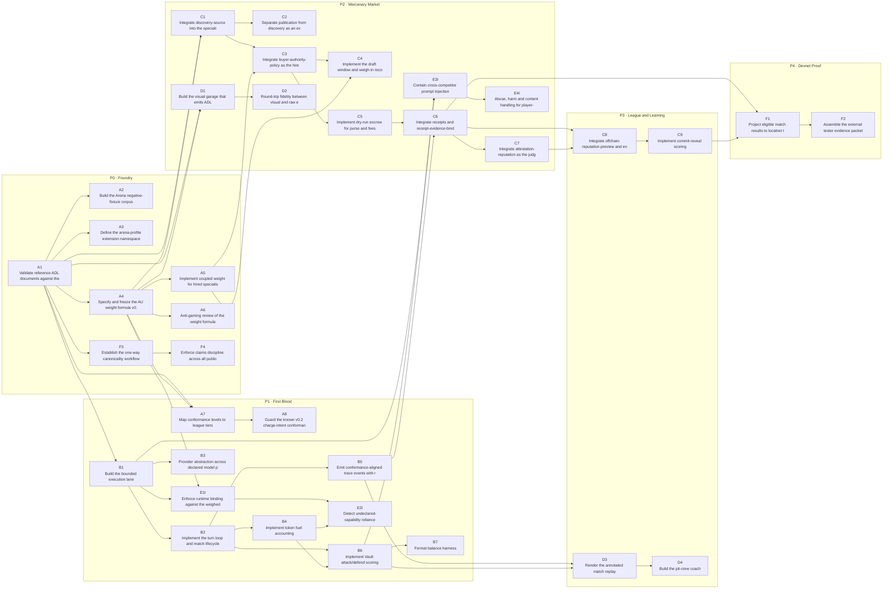

<!-- GENERATED from plan/backlog.yaml by tools/render_plan.py — do not hand-edit. -->

# Reddi Arena — Roadmap (plan-v0.4-superseded, 2026-08-05)

> Reddi Arena is a downstream proof consumer. ADL semantics flow one way from reddiagent-lab into this programme. Arena never forks ADL; it files findings back as issues and evidence. Any Arena-local vocabulary lives under an x- extension namespace until the lab accepts it.

## Phases

| Phase | Name | Intent | Exit gate | Schedulable |
|---|---|---|---|---|
| P0 | Foundry | Deterministic only. Validation, weight, fixtures, paper matches. Zero execution. | All P0 tests green; ADL fixtures validate against published schema. | Yes |
| P1 | First Blood | Local bounded execution at conformance Level 1. Antweight only, Vault only, no hires, and NO PURSE — Level 1 forbids the payment extension outright. | 100 consecutive local matches with complete traces and zero policy escapes. | Yes |
| P2 | Mercenary Market | Discover/Decide/Prove. Dry-run escrow, receipts, weight recompute on hire. | Every paid engagement produces a valid receipt bound to evidence. | Yes |
| P3 | League and Learning | Reputation, multi-format seasons, replay telemetry, pit-crew coaching. | Season completes with reputation derived only from eligible evidence. | Yes |
| P4 | Devnet Proof | Localnet/devnet projection and the external tester evidence packet. | Bounded devnet evidence accepted by lab release-readiness review. | Yes |
| P5 | Real-Value Rails | Any mainnet rail, real custody, or real-money purse. NOT SCHEDULED. Blocked pending official audit completion, findings resolution, go-live readiness, and fresh explicit approval. Listed only to keep it visible. | Out of scope for this programme. | **BLOCKED** |

## Swimlanes

| Lane | Name | Charter |
|---|---|---|
| SL-A | Spec and Conformance | Keep Arena honest to canonical ADL v0.2; own the Arena profile and fixtures. |
| SL-B | Arena Runtime | Bounded match execution, fuel metering, trace emission, arena formats. |
| SL-C | RAP Economy | Discover, Decide, Prove — market, policy, escrow, receipts, reputation. |
| SL-D | Player Experience | Garage, progressive disclosure, replay telemetry, learning mode. |
| SL-E | Trust, Safety and Anti-Cheat | Declaration-behaviour binding, injection containment, abuse handling. |
| SL-F | Release Ops and Evidence | Evidence packets, tester gates, lab feedback loop, public claims discipline. |

## Epics by phase and swimlane

### P0 — Foundry

| Epic | Lane | Name | Outcome | Issues |
|---|---|---|---|---|
| E01 | SL-A | ADL Arena Profile and Fixture Corpus | A competitor bot is expressible as a schema-valid ADL v0.2 document, and a corpus of valid/invalid fixtures exists that the lab can adopt. | A1, A2, A3 |
| E02 | SL-A | Deterministic Weigh-In and Capability Hash | Weight class is a reproducible pure function of a validated ADL document. | A4, A5, A6 |
| E16 | SL-F | Lab Feedback Loop and Claims Discipline | Arena findings reach the lab as evidence, and no Arena surface overstates maturity. | F3, F4 |

### P1 — First Blood

| Epic | Lane | Name | Outcome | Issues |
|---|---|---|---|---|
| E03 | SL-A | Conformance-to-League Mapping | ADL conformance levels gate league entry, so players climb the spec ladder by playing. | A7, A8 |
| E04 | SL-B | Match Engine and Bounded Execution | Two ADL-defined bots run a complete match inside a fail-closed sandbox. | B1, B2, B3 |
| E05 | SL-B | Fuel Metering and Trace Emission | Tokens are a scarce in-match resource and every match yields a complete trace. | B4, B5 |
| E06 | SL-B | Vault Arena Format | One complete, balanced, adjudicable arena format ships end to end. | B6, B7 |
| E13 | SL-E | Declaration-Behaviour Binding | A bot cannot do at runtime what its ADL did not declare. | E1I, E2I |

### P2 — Mercenary Market

| Epic | Lane | Name | Outcome | Issues |
|---|---|---|---|---|
| E07 | SL-C | Discover — Mercenary Market | Specialists advertise bounded capability with traceable provenance. | C1, C2 |
| E08 | SL-C | Decide — Buyer Policy and the Draft Broker | Hiring is a bounded policy decision under budget, trust, and authority constraints, resolved before the match starts. | C3, C4 |
| E09 | SL-C | Prove — Escrow, Receipts and Attestation | Purse and fees move only on the allowed success path, and every movement is bound to evidence. | C5, C6, C7 |
| E11 | SL-D | Garage and Progressive Disclosure | A newcomer assembles a valid bot without reading the spec; an expert hand- writes ADL. Both produce the same artifact. | D1, D2 |
| E14 | SL-E | Injection Containment and Arena Safety | Adversarial content between competitors stays inside the match and cannot reach the platform, the judge, or another player. | E3I, E4I |

### P3 — League and Learning

| Epic | Lane | Name | Outcome | Issues |
|---|---|---|---|---|
| E10 | SL-C | Reputation — Commit-Reveal League Table | Standing derives only from verified work, never from listings or payment alone. | C8, C9 |
| E12 | SL-D | Learning Mode — Replay Telemetry and Pit Crew | Losing a match reliably teaches the player something specific and actionable. | D3, D4 |

### P4 — Devnet Proof

| Epic | Lane | Name | Outcome | Issues |
|---|---|---|---|---|
| E15 | SL-F | Devnet Projection and External Tester Packet | Arena play generates the bounded devnet evidence the protocol repo still owes on the release ladder. | F1, F2 |

### P5 — Real-Value Rails

_No scheduled epics._

## Dependency graph

**Start set (no dependencies):** A1
